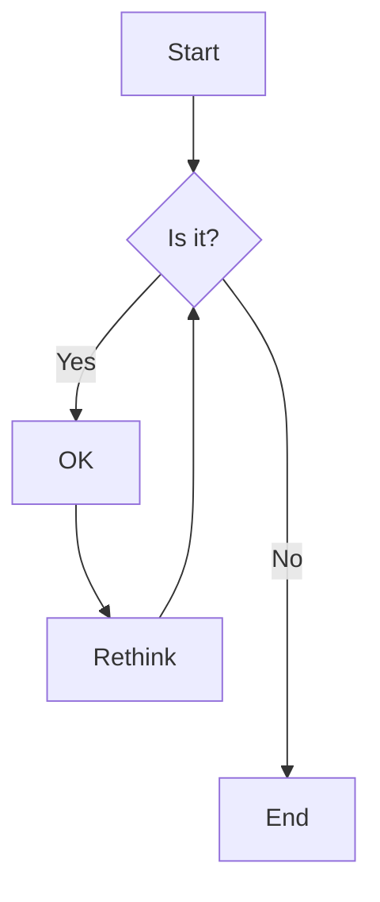
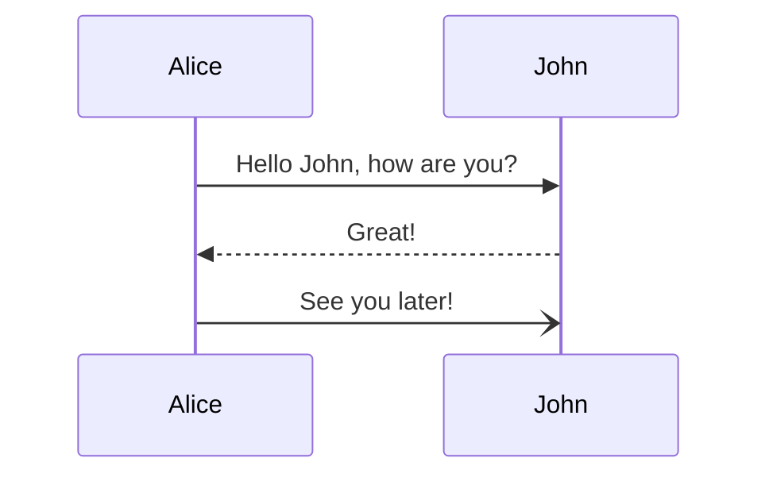

# Diagrams Example

This page demonstrates Mermaid diagrams.

## Flowchart


```mermaid
flowchart TD
    A[Start] --> B{Is it?}
    B -->|Yes| C[OK]
    C --> D[Rethink]
    D --> B
    B ---->|No| E[End]
```

## Sequence Diagram


```mermaid
sequenceDiagram
    Alice->>John: Hello John, how are you?
    John-->>Alice: Great!
    Alice-)John: See you later!
```

## Regular Code Block

```go
package main

func main() {
    println("Hello, World!")
}
```
